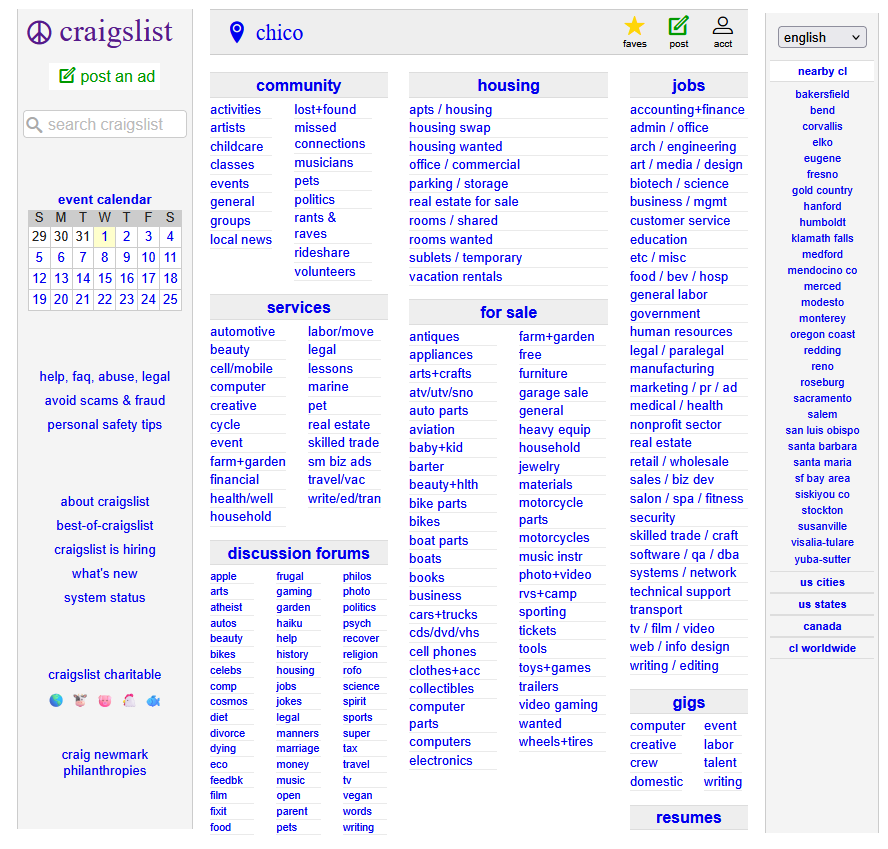
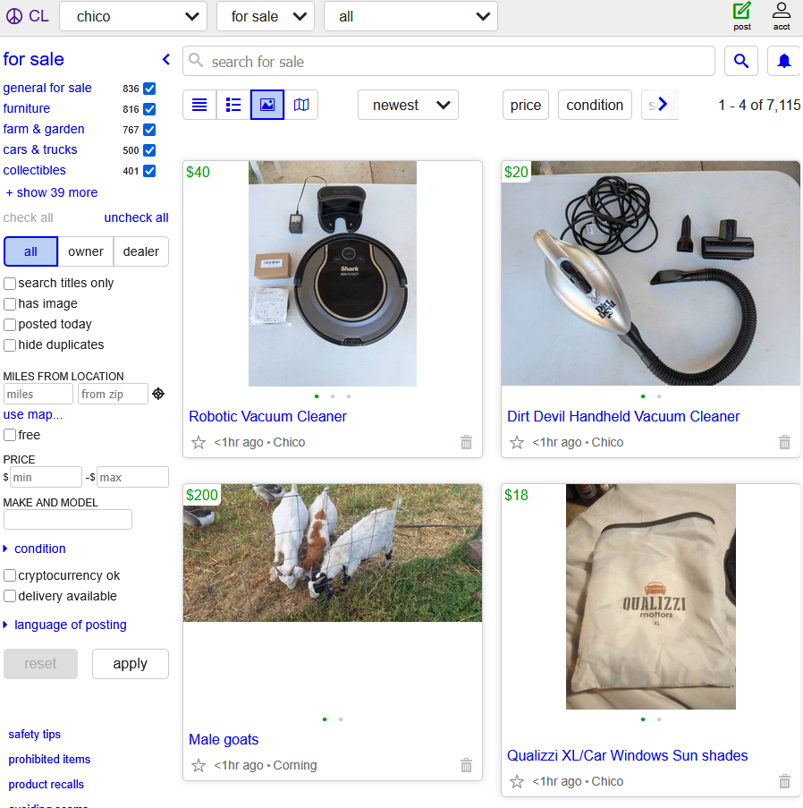
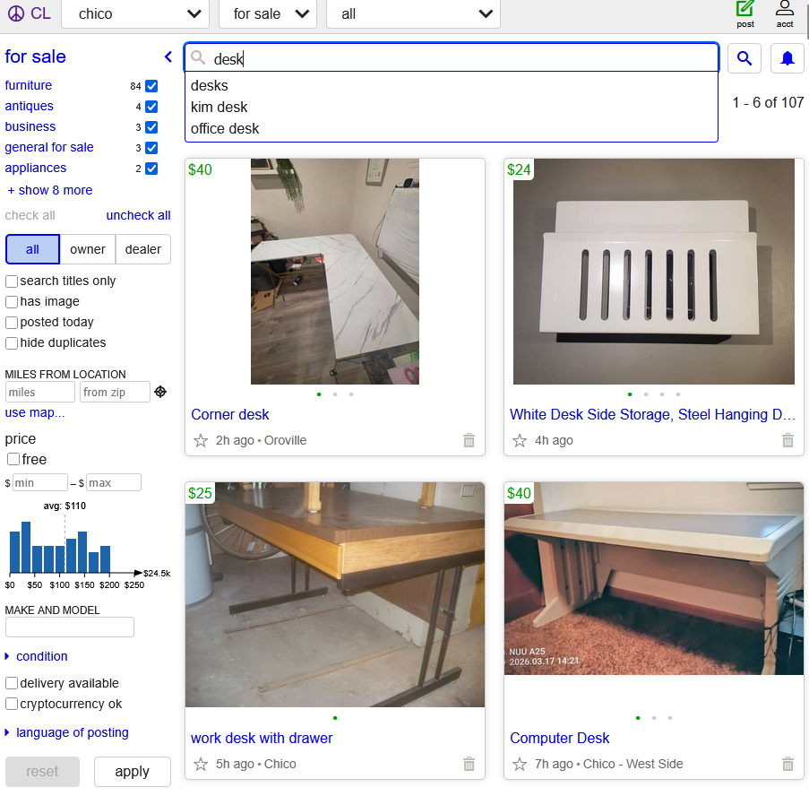
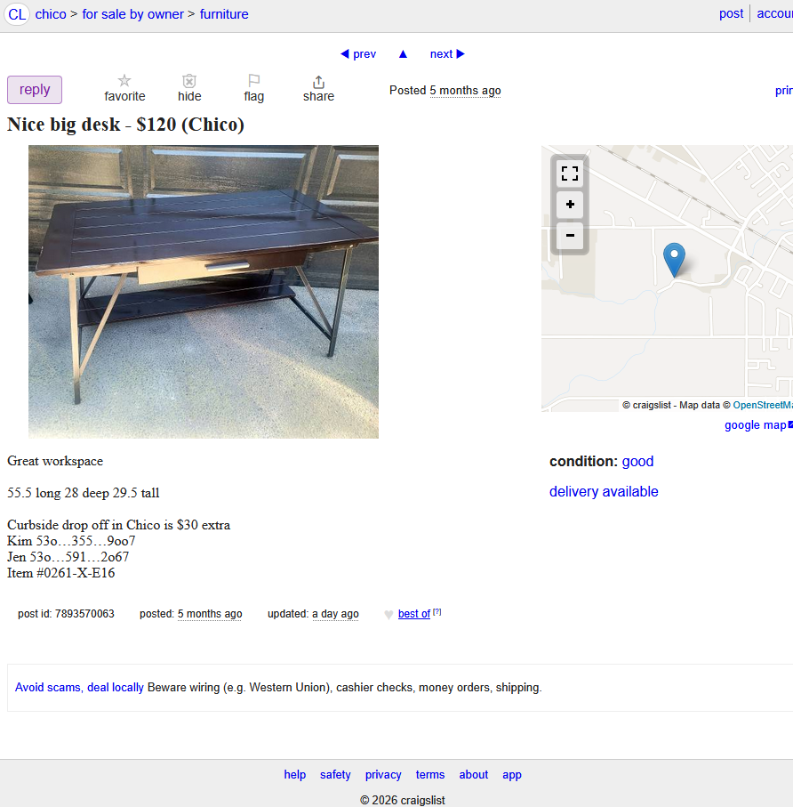

# Hunting for a Desk on Craigslist Shouldn't Be This Hard
 
As a college student in Chico, I'm always looking for cheap furniture. Recently, my desk has been falling apart and I needed a replacement, so I decided to check Craigslist before going to a store. I assumed this would be similar to Facebook Marketplace.
 
## Homepage
 
When I pulled up chico.craigslist.org, I was confused since there were just too many words on my screen. The entire site was on one page. Community, housing, jobs, services, for sale, discussion forums, and gigs all laid out in columns of blue links.
 

 
The only good thing is that it is somewhat organized. The categories are grouped under headers like "for sale" and "housing." But every link looks the same the font, size, and same blue color. Nothing stands out. There are no visuals or hierarchy telling you where to go first. It feels like this site was built 20 years ago and never touched again.
 
That's where my **mental model** was not what I was expecting. A **mental model** is basically the picture in your head of how something should work based on what you've used before. I came in expecting something like Facebook Marketplace a search bar front and center, maybe some big category icons with images, and a clean layout. Instead I just got a wall of text that looked more like a table of contents for a phone book.
 
## Finding a Desk
 
My initial goal was to just find a desk near me in Chico. Looking at the "for sale" section, there are easily 40+ links. I hovered my mouse over a few before clicking "furniture," but honestly it wasn't obvious. The category links looked more like labels or borders than actual buttons. There was nothing that indicated they could be clicked just regular blue text.
 

 
This connects with **learnability**, which is how easy it is for someone to figure out how to use something for the first time. A website with good learnability doesn't make you second-guess yourself. On Facebook Marketplace, you really just type what you want in one search bar and you're done. On Craigslist, I had to scan through a massive list and figure out which category a desk falls under.
 
## Search Results
 
After clicking into the "for sale" section and typing "desk," I got my results.
 

 
The results showed up with photos in a grid, which was nice. But the left sidebar is where things got overwhelming. There are filters for everything, and some don't even make sense like "cryptocurrency ok" or "make and model." It felt like they just threw every possible filter on the page.
 
This ties into **recognition vs. recall**, which is the idea that good design helps you recognize what you need by looking at it rather than forcing you to recall or guess what's relevant. On Facebook Marketplace, the filters are simple and tailored to what you're shopping for. On Craigslist, you get every filter as an option rather than just the ones that actually matter.
 
## The Listing
 

 
I clicked on a desk and the page is about as bare bones as it gets. One photo, a title with the price, a short description the seller typed in, and a map. There are a few small buttons: reply, favorite, hide, flag, and share. The "reply" button was easy enough to spot since it's the only button with a unique color. But calling it "reply" is a weird choice on any other marketplace you'd see something like "Message Seller," making it immediately clear who you're contacting. Someone could easily confuse "reply" with leaving a review or a comment if they've never used Craigslist before.
 
## What Craigslist Gets Right
 
What Craigslist gets right is the simplicity pages load up instantly. There are no pop-ups, no sponsored posts, and no autoplaying videos. It's just a straightforward bulletin board, and there's something trustworthy about a site that isn't trying to sell you on anything extra.
 
## What Could Be Better
 
A simple search bar on the homepage with category icons below it would make the website more approachable. The filters on the search results should be context-aware if I'm looking at furniture, show me relevant filters like price, condition, and delivery. There's no need for additional filters like "cryptocurrency ok" or "make and model" when someone is just looking for a desk. Keep it simple.
